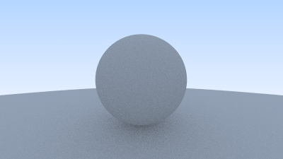
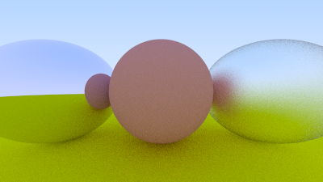
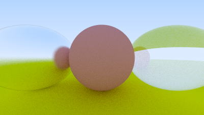

# javaRayTracer

In this project I will code a little ray tracer in good old plain Java. Is it fast? God no. Java is really not the best language for a resource hungry raytracer but I just wanted to refresh my Java skills a bit and learn about raytracing. Can it be optimized? Yes of course, especially multithreading or using a GPU should bring a lot of performance but this is for another time. 

## Features
### Antialising
Antialising is implemented and can be adjusted by samples per pixel.\

### Diffuse materials
Diffuse materials are supported which modulate light with their own base color. It reflects child rays of light in random directions with the true lambertian reflection method.\

### Metal materials
Metal materials are implemented with a new scattered reflection method. Their fuzziness can be parameterized.\
 
 
### Dielectric materials
Dielectric materials represent things like glass, water or diamonds. When they are hit by light, the ray is randomly splitted into a reflected or a refracted ray. The refraction is implemented in a method which describes Snell's Law..\

 
## Reference
As a reference I'm using this nice book about raytracing: https://raytracing.github.io/books/RayTracingInOneWeekend.html
