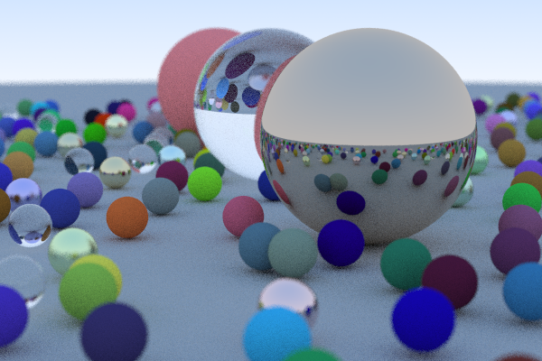

# javaRayTracer

In this project I coded a little ray tracer in good old plain Java. Is it fast? God no. Java is really not the best language for a resource hungry raytracer but I just wanted to refresh my Java skills a bit and learn about raytracing. Can it be optimized? Yes of course, especially multithreading or using a GPU should bring a lot of performance but this is for another time.\
\
The final rendering of the picture above (600x400 pixels) with 50 samples by pixel antialiasing took 8 minutes. Double the size took already almost 1 hour.\
If you like to render your own pixel, check out the WorldGenerator class which I used for the scene building.

## Features
### Objects
It only supports spheres for now

### Antialising
Antialising is implemented and can be adjusted by samples per pixel.\

### Diffuse materials
Diffuse materials are supported which modulate light with their own base color. It reflects child rays of light in random directions with the true lambertian reflection method.\

### Metal materials
Metal materials are implemented with a new scattered reflection method. Their fuzziness can be parameterized.\
 
 
### Dielectric materials
Dielectric materials represent things like glass, water or crystals. When they are hit by light, the ray is randomly splitted into a reflected or a refracted ray. The refraction is implemented in a method which describes Snell's Law. Reflectance is calculated by Schlicks approaximation.\

### Positional camera
The camera is positional with standard look-from, look-at and up parameters and can be adjusted with field of view and zooming. With aperture and distToFocus settings you can control the depth of field.\

## Reference
As a reference I used this nice book about raytracing: https://raytracing.github.io/books/RayTracingInOneWeekend.html
